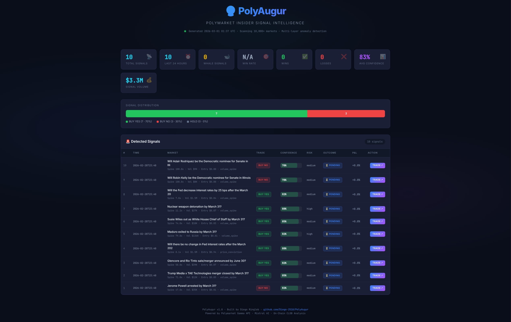

# 🔮 PolyAugur

**Polymarket Insider Signal Detection System**

Detects anomalous trading activity on [Polymarket](https://polymarket.com) that may indicate informed/insider trading. Combines multi-layer statistical anomaly detection, LLM analysis (Mistral), on-chain trade intelligence (CLOB), wallet profiling, and real-time Telegram alerts.

---

## Architecture

```
Gamma API (10,000+ markets)
    │
    ▼
┌─────────────────────────────────────────────────────────────────┐
│  LAYER 1 — Elite Pre-Filter (quantitative, topic-agnostic)      │
│  Spike ≥ 2.5x · Recency ≥ 15% · Horizon ≤ 90d                  │
│  Blacklist: tweets, crypto prices, weather, sport excluded       │
│  → score ≥ 0.45 passed to LLM                                   │
└────────────────────────┬────────────────────────────────────────┘
                         │  ~10–32 flagged markets
                         ▼
┌─────────────────────────────────────────────────────────────────┐
│  LAYER 2 — Mistral LLM Validation (batched, 4/prompt)           │
│  Structured JSON reasoning · Confidence ≥ 0.80 confirmed        │
└────────────────────────┬────────────────────────────────────────┘
                         │  ~1–5 confirmed signals
                         ▼
┌─────────────────────────────────────────────────────────────────┐
│  LAYER 3 — CLOB On-Chain Analysis + Wallet Profiling            │
│  Whale detection · Wallet concentration · Directional bias      │
│  Trader classification (INSIDER/SMART_MONEY/GAMBLER/REGULAR)    │
│  → Confidence boost up to +15%                                  │
└────────────────────────┬────────────────────────────────────────┘
                         │
                         ▼
              SQLite  ·  Telegram  ·  HTML Dashboard
```

## Dashboard Preview

<p align="center">
  
</p>

## Pipeline (9-Step Cycle)

| Step | Component | Description |
|------|-----------|-------------|
| 1 | `data_fetcher.py` | Fetch active markets from Gamma API (paginated, sports filtered) |
| 2 | `data_fetcher.py` | Build market snapshots with real baseline volumes |
| 3 | `orchestrator.py` | Price velocity enrichment (cross-cycle delta tracking) |
| 3.5 | `orchestrator.py` | Elite pre-filter: spike ≥ 2.5x, horizon ≤ 90d, recency ≥ 15% |
| 4 | `anomaly_detector.py` | Multi-layer scoring + blacklist exclusion. Topic keywords boost score, no hard gate. |
| 5 | `orchestrator.py` | Filter score ≥ 0.45, top-32 by score → LLM |
| 6 | `mistral_analyzer.py` | Mistral LLM validation (batched 4/prompt, JSON-mode, whale context) |
| 7 | `trade_analyzer.py` | CLOB on-chain trade analysis (whale detection, wallet concentration, burst timing) |
| 8 | `orchestrator.py` | Whale confidence boost → deduplicate → store → Telegram notify |
| 9 | `performance_tracker.py` | Automatic outcome resolution & P&L tracking (every 10 cycles) |

## Detection Philosophy: Blacklist Mode

**Phase 15** switched from a *whitelist* (only known insider topics allowed) to a *blacklist* (everything is analyzed except explicitly excluded categories).

**Why:** Whitelist mode missed genuine signals when:
- Polymarket titles contained Unicode dashes (`Fed Pause–Pause–Cut`) breaking keyword matching
- New insider categories were not yet in the keyword list
- Markets with unusual volume surges but no exact keyword match were silently dropped

**Now:** Every market with a sufficient volume spike passes to Mistral — which makes the actual quality decision at ≥ 0.80 confidence. Topic keywords still exist as **score boosters**, giving known insider categories priority when the Mistral quota is full.

### Blacklist (Hard Exclusions)

These market types are excluded before scoring — no insider advantage is possible:

- **Countable public activity**: tweet counts, post counts, follower counts
- **Crypto price movements**: Bitcoin, Ethereum, altcoin price predictions
- **Weather / natural events**: hurricanes, earthquakes, rainfall
- **Entertainment**: Oscars, Grammys, box office results
- **Sports outcomes**: Super Bowl, NBA Finals, World Series
- **General sentiment / polling**: approval ratings, favorability polls

### Topic Score Boosters (not gates)

Topics that boost the anomaly score, giving them priority in the Mistral queue:

**Critical (×1.40)** — Someone definitely knows first:
- Military operations, airstrikes, troop deployments
- Federal Reserve / FOMC rate decisions (`fed pause`, `fed cut`, `fomc`, `rate cut`, `next three decisions`, ...)
- FDA drug approvals, emergency use authorizations
- Executive decisions (pardons, nominations, cabinet firings)
- Corporate M&A, CEO resignations, IPO dates
- SEC/ETF rulings

**Elevated (×1.15)** — Insider advantage is plausible:
- Ceasefires, peace deals, hostage releases
- Trade policy, tariffs, sanctions
- DOJ indictments, criminal charges, impeachment
- Government shutdowns, debt ceiling, budget deals
- OPEC production decisions
- Tech regulation, antitrust rulings
- Short-horizon elections (≤ 35 days: mayoral, gubernatorial, runoff, snap)

**No boost (×1.0)** — Everything else: still analyzed, Mistral decides.

### Unicode-Safe Matching

Polymarket titles frequently use Unicode punctuation (`–`, `—`, `…`). Phase 15 normalizes all titles before keyword matching:

```
"Will the Fed Pause–Pause–Cut in the next three decisions?"
→ "will the fed pause pause cut in the next three decisions?"
→ 'fed pause' ✓  'next three decisions' ✓
```

## Other Detection Layers

- **Volume Spikes**: 2.5x–80x+ baseline surges (tiered scoring: 8x+ → max score)
- **Price Conviction**: Extreme YES/NO prices with high volume-to-liquidity pressure
- **Recency Surge**: 24h volume >60% of all-time → active surge multiplier ×1.40
- **Time Horizon**: Markets >365 days penalized; ≤ 14 days get imminent boost ×1.25
- **Whale Detection**: Trades >$5k, wallet concentration >40%, directional bias >85%
- **Timing Bursts**: Last-hour volume vs historical hourly average (3x+ = suspicious)

### Wallet Profiler

Each whale's trading history is analyzed and classified:
- 🧠 **INSIDER**: Win rate >65% OR new account with large bets → confidence +5%
- 🐋 **SMART_MONEY**: Win rate >60%, significant capital → confidence +3%
- 🎰 **GAMBLER**: Win rate <40% with ≥10 resolved bets → confidence −5%
- 👤 **REGULAR**: Neutral impact

## Quick Start

```bash
# Clone & setup
git clone https://github.com/Diego-2510/PolyAugur.git
cd PolyAugur
python -m venv .venv && source .venv/bin/activate
pip install -r requirements.txt

# Configure
cp .env.example .env
# Edit .env: add MISTRAL_API_KEY (required), TELEGRAM_BOT_TOKEN + CHAT_ID (optional)

# Run
python run.py --once          # Single detection cycle
python run.py                 # Continuous polling (30s intervals)
python run.py --cycles 10     # Run 10 cycles
python run.py --stats         # Show DB statistics
python run.py --check         # Check signal outcomes
python run.py --health        # Pre-flight system check
```

## Dashboard & Exports

```bash
python -m src.dashboard                    # Last 24h signals (CLI table)
python -m src.dashboard --hours 72         # Last 72h
python -m src.dashboard --whales           # Only whale-flagged signals
python -m src.dashboard --performance      # Win/loss breakdown
python -m src.dashboard --export csv       # Export to CSV
python -m src.dashboard --export html      # Export dark-mode HTML report
python -m src.dashboard --all --export html # Full history HTML report
```

The HTML report is a self-contained dark-mode dashboard with:
- Stats grid (total signals, win rate, avg confidence, signal volume)
- Trade distribution bar (BUY YES / BUY NO / HOLD)
- Interactive signal table with confidence bars, outcome badges, and direct Polymarket links

## Telegram Alerts

Signals are pushed to Telegram in real-time with:
- Trade direction (BUY_YES / BUY_NO / HOLD)
- Confidence score with whale boost indicator
- Risk level, suggested holding period, position size
- Anomaly type classification and market context
- Daily performance reports with win rate

Setup: Create a bot via [@BotFather](https://t.me/BotFather), get your chat ID, add both to `.env`.

## Environment Variables

| Variable | Required | Description |
|----------|----------|-------------|
| `MISTRAL_API_KEY` | Yes | Mistral AI API key ([console.mistral.ai](https://console.mistral.ai)) |
| `TELEGRAM_BOT_TOKEN` | No | Telegram bot token from @BotFather |
| `TELEGRAM_CHAT_ID` | No | Telegram chat ID for signal alerts |
| `SIGNAL_DB_PATH` | No | SQLite database path (default: `data/signals.db`) |

## Cost Profile

| Resource | Per Cycle | Per Day (24h @ 30s) |
|----------|-----------|---------------------|
| Gamma API | ~10 calls | ~2,880 calls (free) |
| Mistral API | 2–8 calls | ~580–2,300 calls |
| CLOB API | 0–10 calls | ~0–2,880 calls (free) |
| **Estimated cost** | ~$0.005 | **~$2–5/day** |

## Signal Flow Example

```
1. Gamma API returns 800 active markets (volume ≥ $30,000)
2. Elite pre-filter: 800 → ~20 (spike ≥ 2.5x, recency ≥ 15%, horizon ≤ 90d)
3. AnomalyDetector scores 20 → blacklist excludes 2 (tweets/crypto price)
   → 18 scored: 🔴 5 critical-boosted, 🟡 4 elevated-boosted, ⚪ 9 no-topic
4. Score ≥ 0.45: 12 flagged → top-32 sorted by score → Mistral (3 batches)
5. Mistral confirms 4 (confidence ≥ 0.80)
6. CLOB analyzes 4 → 1 has whale activity (3 whales, 89% directional BUY)
7. Whale boost: confidence 0.82 → 0.92 (+0.10)
8. Signal saved to SQLite, pushed to Telegram
9. After market resolves: outcome checked, P&L recorded
```

## Key Design Decisions

- **Blacklist over whitelist**: All markets pass unless explicitly excluded — no unknown insider category is silently dropped. Mistral is the quality gate.
- **Unicode normalization**: Polymarket titles with `–`, `—`, `…` are normalized before all keyword matching — eliminates a class of silent false negatives.
- **Topic boosting, not gating**: Known insider categories get higher scores (preferred Mistral queue position), but all markets above the score threshold reach Mistral.
- **Mistral at 0.80**: Deliberately high confirmation threshold — fewer signals, higher precision.
- **Wallet profiling**: Not all whales are equal — classifying traders by historical performance avoids boosting signals driven by known gamblers.
- **Time horizon filter**: Markets >365 days penalized; ≤ 14 days get imminent boost.
- **Whale confidence boost**: On-chain evidence increases confidence by up to +15%.
- **Deduplication**: 4-hour window prevents repeat signals for the same market.
- **Graceful degradation**: Rule-based fallback when Mistral API is unavailable.
- **Production-ready**: systemd service file, health monitoring, exponential backoff, auto-restart on errors.

## Project Structure

```
PolyAugur/
├── run.py                      # Production entrypoint (--once, --cycles, --stats, --check, --health)
├── config.py                   # All configuration & thresholds
├── requirements.txt            # Python dependencies
├── polyaugur.service           # systemd service for 24/7 deployment
├── .env.example                # Environment variable template
│
├── src/
│   ├── __init__.py
│   ├── data_fetcher.py         # Gamma API client + snapshot builder
│   ├── anomaly_detector.py     # Blacklist mode: scoring, Unicode normalization, topic boosters
│   ├── mistral_analyzer.py     # Mistral LLM signal validation (batched, JSON-mode)
│   ├── trade_analyzer.py       # CLOB on-chain whale detection
│   ├── wallet_profiler.py      # Wallet history analysis & trader classification
│   ├── signal_store.py         # SQLite persistence + dedup + schema migration
│   ├── telegram_notifier.py    # Telegram push notifications + daily reports
│   ├── performance_tracker.py  # Automatic outcome resolution & P&L tracking
│   ├── dashboard.py            # CLI signal explorer + CSV/HTML export
│   ├── health.py               # Pre-flight checks, health monitoring, error tracking
│   └── retry.py                # Exponential backoff decorator for API resilience
│
├── data/                       # SQLite database (gitignored)
├── logs/                       # Log files (gitignored)
└── exports/                    # CSV/HTML exports (gitignored)
```

## Tech Stack

- **Python 3.11+**
- **Mistral AI** (`mistral-large-latest`) — LLM signal validation
- **SQLite** — Signal persistence, deduplication, outcome tracking
- **Telegram Bot API** — Real-time alerts & daily reports
- **Polymarket Gamma API** — Market data (10,000+ markets)
- **Polymarket CLOB API** — On-chain trade data (whale detection)

## Acknowledgments

This project was built during the **Mistral AI Hackathon** (March 2026) and uses the following open-source libraries and APIs:

- **[Mistral AI](https://mistral.ai)** — LLM signal validation via `mistral-large-latest` ([mistralai](https://pypi.org/project/mistralai/) Python SDK)
- **[Polymarket](https://polymarket.com)** — Market data via [Gamma API](https://gamma-api.polymarket.com) and [CLOB API](https://clob.polymarket.com)
- **[Requests](https://docs.python-requests.org)** — HTTP client for API communication
- **[NumPy](https://numpy.org)** — Numerical computations for anomaly scoring
- **[python-dotenv](https://github.com/theskumar/python-dotenv)** — Environment variable management
- **[Pandas](https://pandas.pydata.org)** — Data manipulation
- **[Plotly](https://plotly.com/python/)** — Visualization library
- **[Streamlit](https://streamlit.io)** — Web app framework

## Author

**Diego Ringleb** — Berlin, 2026

## License

MIT

---

> **Disclaimer**: This is a research/educational tool built for a hackathon. It monitors publicly available market data for statistical anomalies — it does not facilitate, encourage, or automate any trading. Signals are not financial advice. Use at your own risk. Always do your own research before trading on prediction markets.